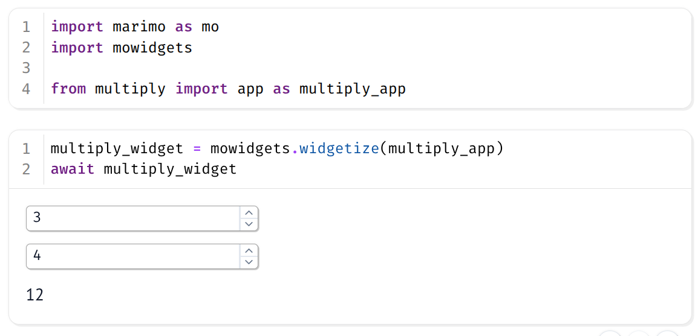
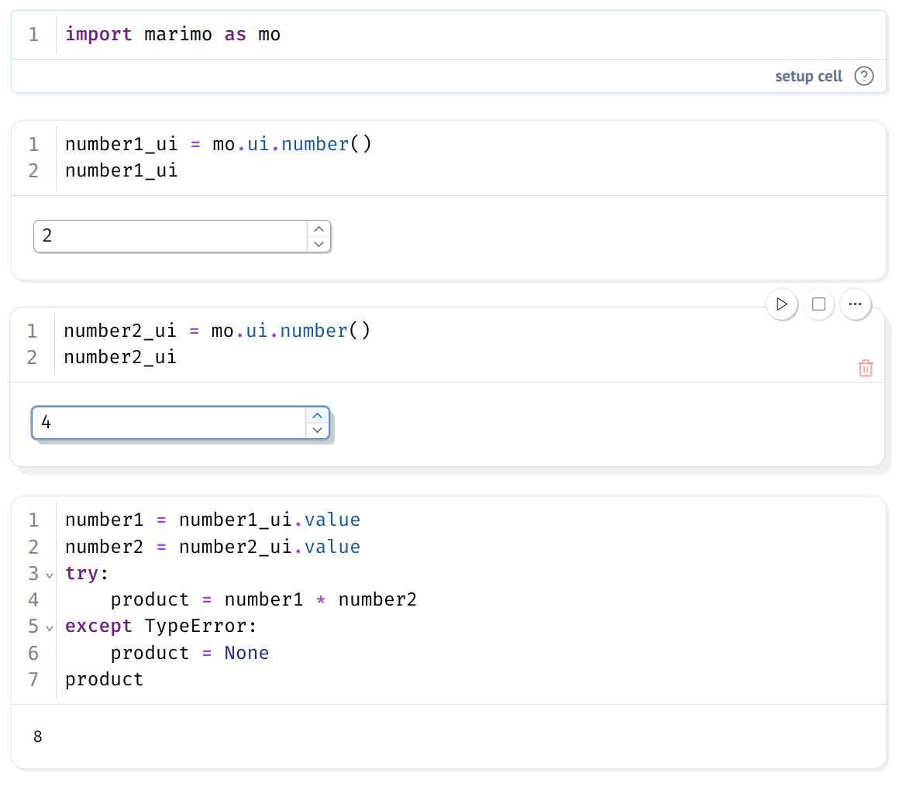
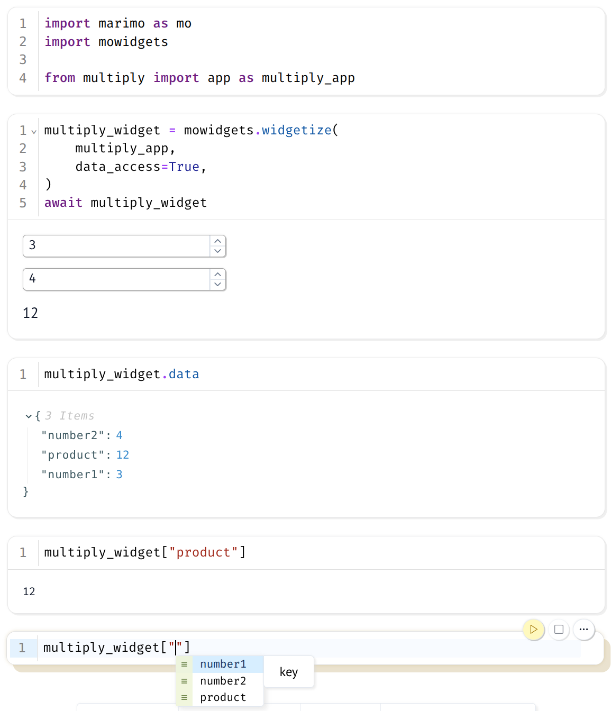

# mowidgets

Reuse [marimo](https://github.com/marimo-team/marimo) notebooks as widgets inside other marimo notebooks! This allows to build libraries of reusable widgets and distribute them.

This uses native `marimo` features and the standard Python library; no extra dependencies.

## Installation
```
pip install mowidgets
```

## Tutorial

As an example, we create a simple widget that multiplies two numbers and displays the result.

<p align="center">
  
</p>

1. Create a marimo notebook to define the widget.

    ```shell
    marimo edit multiply.py  # widget module name
    ```

  <p align="center">
    
  </p>

2. Create a marimo notebook for the main app.

    ```shell
    marimo edit app.py
    ```

3. From the `multiply` (widget module name) Python module, import the `app` variable. It should be an instance of `marimo.App`. I suggest using a [setup cell](https://docs.marimo.io/guides/reusing_functions/#1-create-a-setup-cell).

    ```python
    from multiply import app as multiply_app
    ```

4. Use `mowidgets.widgetize()` on the `marimo.App` instance to create the widget.

    ```python
    multiply_widget = mowidgets.widgetize(multiply_app)
    ```

5. Call `await` in front of the widget instance to render it.

    ```python
    await multipler_widget
    ```

6. Now, if you use `mowidgets.widgetize(..., data_access=True)`, you can read the values exposed by the widget. You even get autocompletion!

  <p align="center">
    
  </p>

> See the `examples/` directory to see complete files.

## Next steps
- Pass starting values to the `MoWidget` instance. This would allow to compose widgets together. (Idea well-received by the core dev team)
- Have `MoWidget` expose a reliable  input and output schema. Optionally add type coercion via Pydantic.
- Simplify the import experience. Currently, the user must import the `marimo.App` instance in the main namespace for the widget to properly refresh.


